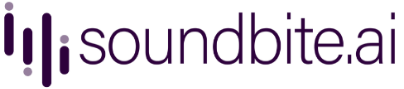
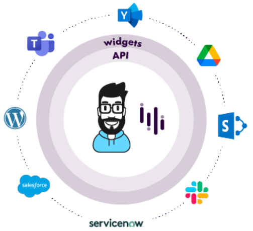

Visit our website at [www.Soundbite.ai](https://www.soundbite.ai) or e-mail us at [Support@Soundbite.Freshdesk.Com](mailto:Support@Soundbite.Freshdesk.Com).

Soundbite is a secure communications platform for building short-form audio experiences. At its core, our platform is web-api that can be leveraged to build highly customized
audio solutions. We provide a core set of NPM packages to help web developers interact with our
platform, and a series of fully functional UI widgets that can easily be embedded into an existing
application.

In this document you will find links to the NPM packages that we provide to help integrate our 
platform with your solution, as well as documentation to help you get started developing.

# Documentation

- [Getting Started API Guide](docs/getting-started-api.md)
- [Getting Started Widget Guide](docs/getting-started-widgets.md)
- [Axios HTTP Adapter](docs/http-adapter-axios)
- [Custom HTTP Adapters](docs/http-adapter-custom)
- [Glossary](docs/glossary.md)

# NPM Packages
Our core NPM packages provide not only a Typesript client library for connecting to the API, but a complete data store system implemented in [mobx](https://mobx.js.org/README.html), and UI widgets in React. NOTE: our packages use [React version 16](https://reactjs.org/blog/2017/09/26/react-v16.0.html) to preserve compatibility with Microsoft's SPFx framework.

[NPM Packages v1.0.0](releases/npm/v1.0.0/notes.md)

# SharePoint Web Part Packages

[v1.0.0.1]

# Contact Us
If you have any questions or comments on our libraries, wish to contribute, or reach out regarding technology partnership, please reach out to our [support email at Support@Soundbite.Freshdesk.Com](mailto:Support@Soundbite.Freshdesk.Com) and we'll get back to you quickly. Alternatively, open an issue on this project and we'll be keeping an eye out for you. Thank you!
